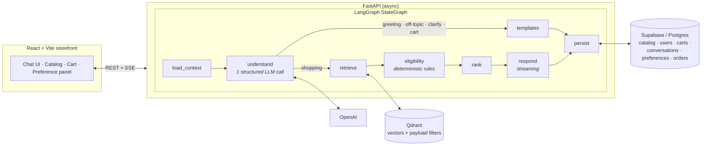

# 🛍️ Smart Shopping Assistant

**An AI-powered consumer intelligence engine that personalizes shopping end to end** — conversational product discovery, preference learning, intelligent cart optimization, and durable cross-device identity, built on a LangGraph agent that can never hallucinate a product.


---

## Why this is interesting

Most LLM shopping bots either hallucinate products or bolt a chatbot onto a search box. This project takes a different stance:

> **AI generates. Deterministic rules decide.**

One structured LLM call per turn *understands* the message — intent, hard constraints, durable preference changes. Everything after that is deterministic: constraints are pushed down into the vector search as payload filters, an eligibility engine re-verifies every candidate against live catalog data, and a transparent scoring engine ranks what survives. The LLM streams the reply, but it **cannot recommend a product the rules rejected** — the guardrail is enforced in code, twice.

## Features

**Conversational shopping**
- Natural-language search over a richly-attributed catalog: *"a Samsung phone in black, under €700, with at least 128GB"* — brand, budget, color, and spec filters all enforced deterministically
- Streaming replies (SSE) with product cards embedded in the stream — no follow-up fetches
- Follow-up awareness: *"and in blue?"*, *"show me others"* (excludes what you've already seen), *"yes, relax the budget"* — and an honest "you've seen all N matches" instead of a dead end
- Color families (*"titanium"* → gray, *"navy"* → blue) and currency normalization (Rs / ₹ / $ amounts read as EUR, disclosed in the reply)
- Sub-category precision: asking for *speakers* never returns earbuds; *smartwatch* never returns fitness bands

**Preference learning** (persisted per user, visible & editable in the UI)
- Conversational: *"my budget for smartphones is 300–500"* (per-category budgets), *"never show me Apple"* (hard exclusion until retracted), *"I love photography"* (soft affinities with recency decay)
- Behavioral: add-to-cart, remove, and purchase events adjust brand/category/feature affinities; purchases set an inferred budget prior (ranking-only, never a hard filter)
- Browse vs. recommend distinction: *"show me all tablets"* lists the whole section; *"suggest a tablet"* applies your saved preferences

**Memory at scale**
- Per-message persistence (no growing blobs), rolling per-conversation summaries, and semantic recall over all past messages in Qdrant — prompt size stays bounded no matter how long the history grows

**Commerce**
- Server-side cart with optimistic-concurrency writes, guest→account merge on login, catalog-grounded bundle suggestions, next-best-action nudges, persisted orders

## Architecture



Every turn produces a `receipts` object — which products were retrieved, which rules fired, what was shown — so ranking is auditable, never a black box.

```
Smart-Shopping-Assistant/
├── backend/              # FastAPI + LangGraph agent → see backend/README.md for internals
│   ├── app/              # agents · preferences · conversations · retrieval · engine · api
│   ├── data/catalog.json # 50-product seed with per-category attributes
│   ├── db/schema.sql     # idempotent Postgres schema (auto-applied at startup)
│   ├── tests/            # hermetic unit + API contract tests
│   └── evals/            # behavioral evals against the real LLM pipeline
├── frontend/             # React 18 + TypeScript + Vite + Tailwind
└── docker-compose.yml    # Qdrant + backend
```

## Getting started

**Prerequisites:** Python 3.11+ · Node 20+ · a [Supabase](https://supabase.com) project · a [Qdrant](https://qdrant.tech) instance (cloud, or `docker compose up qdrant`) · an OpenAI API key

### 1 · Backend

```bash
cd backend
python3.11 -m venv .venv && source .venv/bin/activate
pip install -r requirements.txt
cp .env.example .env          # fill in the values below
python update_catalog.py      # seed Supabase + Qdrant with the 50-product catalog
uvicorn app.main:app --reload # → http://127.0.0.1:8000/docs
```

| Variable | Purpose |
|---|---|
| `OPENAI_API_KEY` | LLM + embeddings (`gpt-4o-mini`, `text-embedding-3-small`) |
| `QDRANT_URL` / `QDRANT_API_KEY` | Vector search (API key for Qdrant Cloud) |
| `SUPABASE_URL` / `SUPABASE_KEY` | Postgres via the Supabase service-role key |
| `SUPABASE_DB_URL` | Direct Postgres connection — lets the server **create/migrate tables automatically at startup** (idempotent, non-destructive). Without it, run `backend/db/schema.sql` once in the SQL editor |
| `AUTH_SECRET` | JWT signing key, ≥32 chars — `python -c "import secrets; print(secrets.token_urlsafe(48))"` |
| `REQUIRE_LOGIN_FOR_CHAT` | `true` (default): chat needs an account; guests can still browse & cart. `false`: guest-first chat with merge-on-login |
| `STORAGE_BACKEND` | `supabase` (production) · `memory` (tests/offline dev) |

### 2 · Frontend

```bash
cd frontend
npm install
npm run dev                   # → http://localhost:5173
```

### 3 · Verify

```bash
cd backend
python -m pytest tests        # 36 hermetic tests — no network needed
python -m evals.run_evals     # behavioral evals against real OpenAI + Qdrant
cd ../frontend && npm run typecheck
```

### Docker

```bash
docker compose up --build     # Qdrant + backend on :8000 (Supabase stays cloud)
```

## API overview

| Endpoint | Description |
|---|---|
| `POST /chat` | One chat turn → `{reply_text, recommendations, products, nba, cart, receipts, conversation_id}` |
| `POST /chat/stream` | Same turn over SSE: `token` deltas → `recommendations` (full products) → `nba` → `done` |
| `GET /chat/history` · `GET /chat/conversations` · `DELETE /chat/conversations/{id}` | Thread management |
| `GET /catalog` · `GET /catalog/{id}` | Catalog, ranked live against the session's preferences |
| `GET /cart/summary` · `POST /cart/add·remove·set` · `GET /cart/suggestions` · `POST /cart/checkout` | Cart & orders |
| `POST /auth/register` · `POST /auth/login` · `GET /auth/me` | Accounts (guest state merges on login) |
| `GET /session/profile` · `PATCH /session/profile` | Inspect & edit what the assistant has learned |
| `GET /health` · `GET /ready` | Liveness / dependency readiness probes |

Interactive docs at `/docs` (Swagger). Full backend internals in [`backend/README.md`](backend/README.md).

## Security

- **Auth:** JWT access tokens (HS256) · Argon2id password hashing (legacy hashes transparently re-hashed on login)
- **Ownership everywhere:** every session-scoped endpoint verifies the caller — guest sessions are unguessable capabilities, account sessions require a matching bearer token
- **Login-gated chat** by default (configurable) · rate limiting on auth and LLM-spending endpoints · CORS origin allowlist · RLS enabled on all tables (service-role key stays server-side)

## Operations

- **Zero-touch schema:** tables, columns, and vector collections are created/updated idempotently at startup — never destructively
- **Observability:** structured JSON logs with request IDs; `/ready` checks Supabase + Qdrant
- **Data lifecycle:** `python update_catalog.py` re-syncs the catalog in place; `python clear_user_data.py` wipes all user data (carts, conversations, preferences, memory vectors) without touching the catalog

## License

No license has been granted yet — all rights reserved by the authors.
