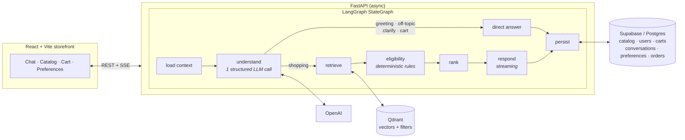

<div align="center">

# 🛍️ OneShop AI

**A conversational shopping assistant you can trust in front of customers.**

It talks naturally, remembers each shopper, learns their preferences over time — and every product it recommends is real, in stock, and explainable.


[Why it matters](#why-it-matters) · [What it does](#what-it-does) · [How it works](#how-it-works) · [Quick start](#quick-start) · [Configuration](#configuration) · [Quality](#quality-and-evaluation)

</div>

---

## Why it matters

Putting an AI assistant in front of shoppers is risky. Most fail in one of two ways: they **make things up** — products, prices, discounts that don't exist — or they're a **chatbot bolted onto a search box** that forgets the customer the moment the conversation ends.

OneShop AI is built on one rule:

> **The AI understands the customer. The code decides what to sell.**

The language model does what it is best at: reading a message and working out what the shopper wants. Everything that touches the catalog — what qualifies, what ranks first, what gets shown — is ordinary, testable software. The model writes the reply, but only from products that have already cleared every check. **It has no way to invent one.**

What that buys you:

| | |
|---|---|
| **Zero hallucinated products** | Every recommendation is a real item, at its real price, verified in stock at the moment it's shown |
| **Customers who are remembered** | Preferences, budgets, and conversation history follow the shopper across sessions and devices |
| **Recommendations you can defend** | Every result comes with a plain record of what was considered, which rules applied, and why it ranked where it did |
| **Cost under control** | One model call to understand, one to reply — no runaway agent loops |

---

## What it does

An **agentic workflow** built on LangGraph: a graph of specialized agents, each owning one job — understanding, retrieval, guardrails, ranking, response — with deterministic hand-offs between them. Here is what that delivers.

#### 🧭 Understanding agent
- **One structured call extracts everything** — intent, hard constraints (price, brand, category, color, specs, rating, deals), a search phrase, and preference updates to remember.
- **Intent routing** sends greetings, off-topic, cart, and vague requests to direct answers — the catalog is never touched, and no tokens are wasted.
- **Multi-turn context** — refinements build on the last request, "alternatives" exclude what was shown, and relaxing a constraint re-runs the search without it.
- **Normalization** — everyday product words, color shades, and foreign currencies resolve to canonical catalog terms.
- **Browse vs. advise** — listing a whole section ignores personal preferences; asking for a recommendation applies them.
- **Fallback extraction** keeps search working if the model call fails.

#### 🔎 Grounded retrieval (RAG)
- **Filter-inside-search** — hard constraints are pushed into the vector query, so results only ever contain qualifying products.
- **Hybrid retrieval** — structured catalog scan takes over for spec-only queries or if the vector store is down.
- **Live facts stay live** — prices and stock come from the database on every turn, never from an embedding.

#### 🛡️ Deterministic guardrail
- Every candidate is **re-verified in code** against live data and the shopper's profile — budget, stock, exclusions, category, color, specs, rating, rejected items.
- Each rule that fires is **named**, so "no results" always says *which* requirement eliminated everything.
- Enforced **twice** — at ranking and again before the reply is sent. The model cannot introduce a product.

#### 📊 Explainable ranking
- Four transparent signals: **request match, personal fit, budget headroom, quality**.
- **Cold-start → personalized** — weights shift from relevance toward personal fit automatically as a profile matures.
- **Diversified** top picks, never padded with weak matches.
- A **receipt on every response** — what was retrieved, which rules fired, what was shown. No invented scores.

#### 🧠 Preference modeling
- **Explicit signals** from conversation: per-category budgets, brand and feature affinities, attribute preferences, deal-seeking, and hard exclusions that hold until retracted.
- **Implicit signals** from behavior: cart adds, removals, and purchases reshape the profile; a purchase sets a soft budget expectation.
- **Temporal decay** fades casual interests while budgets and exclusions persist. **Profile merge** on sign-in keeps the stronger signal.
- **Transparent and editable** by the shopper.

#### 💾 Short- and long-term memory
- **Short-term** — the recent window goes to the model verbatim.
- **Long-term** — older turns fold into a rolling summary; every message is indexed for **semantic recall** across past conversations.
- **Constant prompt size** whether the customer has sent five messages or five hundred.

#### 💬 Response agent
- **Streaming replies** with product cards in the same stream — nothing to wait for, nothing to re-fetch.
- Grounded strictly in the products that passed and the shopper's known profile.
- **Next-best-action** nudges (compatible accessories, free-shipping distance) computed from catalog and cart — never generated.

#### 🛒 Storefront and identity
- Personally ranked browsing, a cart that can't lose concurrent updates, bundle suggestions, and multi-step checkout with saved orders.
- **Guest-first, merge on sign-in** — cart, preferences, and history follow the shopper to any device.
- Email/password and **Google Sign-In**, with Google identities linked to existing accounts by verified email.
- Saved conversations, voice search, light and dark themes, and fault isolation between panels.

---

## How it works



**One customer message, start to finish:**

1. **Load context** — cart, preferences, conversation summary, and recent messages are fetched in parallel, while relevant past moments are recalled alongside.
2. **Understand** — the single structured model call.
3. **Route** — anything that isn't a shopping request is answered directly.
4. **Retrieve** — filtered vector search, with a structured fallback.
5. **Check eligibility** — deterministic re-verification with named rules.
6. **Rank** — weighted signals, diversification, next-step suggestions.
7. **Respond** — a streamed reply grounded only in products that passed.
8. **Persist** — one batched write; memory indexing and summarization happen off the critical path.

---

## Technology

| Layer | Choice | Why |
|---|---|---|
| Agent orchestration | LangGraph `StateGraph` | The pipeline is an explicit, readable graph — easy to test and reason about |
| Language model | OpenAI `gpt-4o-mini` | Structured output for understanding; streaming for replies |
| Embeddings | `text-embedding-3-small` (256d) | Fast and inexpensive at this catalog size |
| Vector search | Qdrant | Supports filtering inside the search, not just after it |
| Database | Supabase / Postgres | Single source of truth for live prices, stock, and all customer state |
| API | FastAPI (async) | Streaming responses, typed contracts, generated documentation |
| Frontend | React 18 · TypeScript (strict) · Vite · Tailwind | — |
| Authentication | Argon2id · JWT · Google Identity Services | — |

---

## Project structure

```
OneShop-AI/
├── backend/
│   ├── app/
│   │   ├── agents/          # the graph, structured understanding, reply composition
│   │   ├── engine/          # deterministic eligibility rules
│   │   ├── recommend/       # ranking signals, diversification, next-step suggestions
│   │   ├── retrieval/       # catalog cache, vector ingestion, hybrid retriever
│   │   ├── preferences/     # shopper profile model, learning, persistence
│   │   ├── conversations/   # message store, rolling summaries, semantic recall
│   │   ├── session/         # cart, checkout, guest→account merge
│   │   ├── auth/            # passwords, tokens, Google sign-in verification
│   │   └── api/             # chat (JSON + streaming), catalog, cart, auth, profile
│   ├── data/catalog.json    # 50-product seed catalog with detailed attributes
│   ├── db/schema.sql        # database schema, applied automatically at startup
│   ├── tests/               # fast, self-contained unit and API tests
│   └── evals/               # behavioral checks against the real AI pipeline
├── frontend/                # React storefront — see frontend/README.md
└── docker-compose.yml       # Qdrant + backend
```

Backend internals are documented in [`backend/README.md`](backend/README.md).

---

## Quick start

**You'll need:** Python 3.11+, Node 20+, an OpenAI API key, a [Supabase](https://supabase.com) project, and a [Qdrant](https://qdrant.tech) instance (cloud, or `docker compose up qdrant`).

```bash
# Backend
cd backend
python3.11 -m venv .venv && source .venv/bin/activate
pip install -r requirements.txt
cp .env.example .env            # fill in values — see Configuration
python update_catalog.py        # load the catalog into Supabase + Qdrant
uvicorn app.main:app --reload   # → http://127.0.0.1:8000/docs

# Frontend (new terminal)
cd frontend
npm install
npm run dev                     # → http://localhost:5173
```

Or start Qdrant and the backend together with `docker compose up --build`.

---

## Configuration

**Backend** (`backend/.env`)

| Variable | Purpose |
|---|---|
| `OPENAI_API_KEY` | Language model and embeddings |
| `SUPABASE_URL`, `SUPABASE_KEY` | Database access via the service-role key — server-side only |
| `QDRANT_URL`, `QDRANT_API_KEY` | Vector search (key required for Qdrant Cloud) |
| `AUTH_SECRET` | Token signing key, at least 32 characters |
| `SUPABASE_DB_URL` | Optional. When set, the database schema is created and updated automatically at startup — safely, never deleting data. Otherwise run `db/schema.sql` once |
| `GOOGLE_CLIENT_ID` | Optional. OAuth 2.0 Web application Client ID. Leave empty to hide Google Sign-In |
| `REQUIRE_LOGIN_FOR_CHAT` | `true` asks shoppers to sign in before chatting; browsing and the cart stay open to guests |
| `STORAGE_BACKEND` | `supabase` for production, `memory` for tests and offline development |
| `CORS_ORIGINS` | Comma-separated list of allowed frontend origins |

Retrieval depth, number of recommendations, memory window, and cache lifetime are tunable in [`backend/app/config.py`](backend/app/config.py).

**Frontend** (`frontend/.env`)

| Variable | Purpose |
|---|---|
| `VITE_API_URL` | Backend address (default `http://127.0.0.1:8000`) |
| `VITE_GOOGLE_CLIENT_ID` | Same Client ID as the backend; safe to expose |

Frontend variables are baked in at build time — changing one requires a rebuild.

---

## Quality and evaluation

```bash
cd backend
python -m pytest tests        # fast and self-contained — no network, model mocked
python -m evals.run_evals     # behavioral checks against the real model and vector store
cd ../frontend && npm run typecheck
```

The unit tests cover the eligibility rules, preference learning, and every API contract. The evaluation suite runs the real AI pipeline end to end and checks **behavior, not wording**: budgets are respected, currencies are handled, brand exclusions survive into new conversations, spec and color filters hold, combined constraints work together, shopping behavior changes ranking, and off-topic requests are declined without showing products.

---

## Deployment

The frontend and backend deploy separately. The frontend is a static build that runs on any static host. The backend ships with a `Dockerfile` for any container platform, and benefits from a long-running process so connections and the catalog cache stay warm. After deploying, set `CORS_ORIGINS` to the frontend's real address.

---

## Security and operations

- **Sign-in:** passwords hashed with Argon2id; signed session tokens; Google sign-ins verified against Google's published keys, including audience, issuer, expiry, and email-verification checks. Google-only accounts have no password to attack.
- **Access control:** every request that touches a shopper's data verifies who is asking. Guest sessions are unguessable; account sessions require a valid token.
- **Abuse protection:** rate limits on sign-in and on every endpoint that spends model credits. Database tables are locked down so only the server can reach them.
- **Zero-touch schema:** tables and vector collections are created and updated automatically at startup, never destructively.
- **Observability:** structured logs with request IDs; a readiness endpoint reports the health of each dependency.
- **Data lifecycle:** one command re-syncs the catalog in place; another clears customer data while preserving accounts and the catalog.

---

## License

No license has been granted yet — all rights reserved by the authors.
